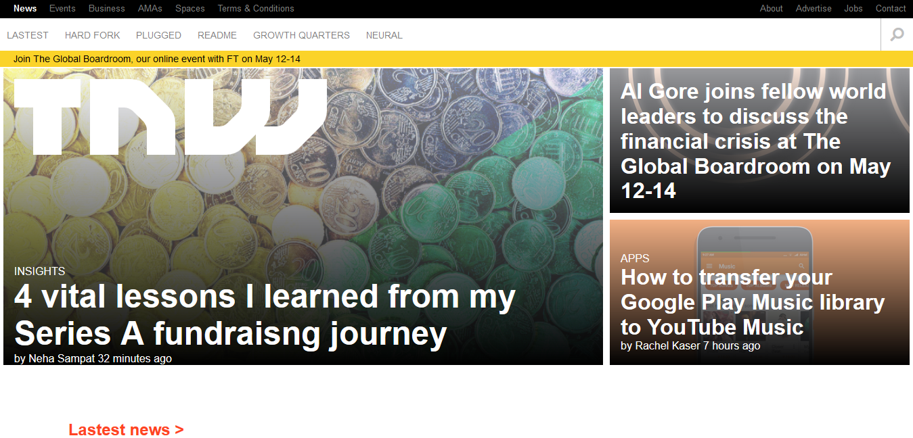

# Building with Responsive Design-Samuel&Juan
 This project consists of replicating the The Next Web website putting emphasis on how it behaves differently depending on the size of the screen where the website is rendered.

 > We replicated the front page of www.thenextweb.com including their responsiveness.
 
 
 
 Additional description about the project and its features.

## Built With

- HTML
- CSS

## Live Demo

[Live Demo Link](https://rawcdn.githack.com/SigmaSam/Building-with-Responsive-Design-Samuel-Juan/f49fa110b5115a7ca02139dd883880e176a1ab00/index.html)

## Getting Started

To get a local copy up and running follow these simple example steps.

- Open a web browser

- [Visit Repository](https://github.com/SigmaSam/Building-with-Responsive-Design-Samuel-Juan/tree/BuildingResponsive)

- Download Repository

- Run index.html file (into folder html)

## Authors

**Samuel Isaac Almao Herrera**

- Github [@SigmaSam] (https://github.com/SigmaSam)

**Juan Jacobo Hincapie Montes**

- Gmail: [@gmail](jacobo12.montes@gmail.com)
- Github: [@githubhandle](https://github.com/jacobo12montes)
- Twitter: [@twitterhandle](https://twitter.com/HincapieMontes)
- Linkedin: [linkedin](https://www.linkedin.com/in/juan-jacobo-hincapi%C3%A9-montes-93975210b/)

Contributions, issues and feature requests are welcome!

Feel free to check the [issues page](https://github.com/SigmaSam/Building-with-Responsive-Design-Samuel-Juan/issues).

## Show your support

Give a ?? if you like this project!

## Acknowledgments

- Hat tip to anyone whose code was used
- Inspiration
- etc

## License

This project is [MIT](lic.url) licensed.
